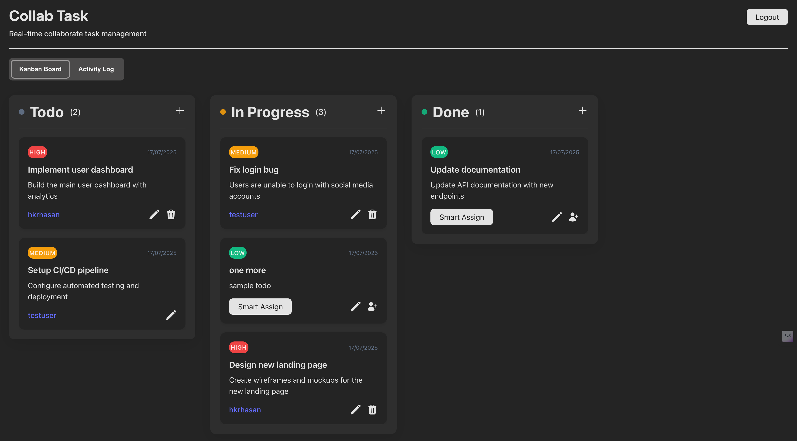

# Real-Time Collaborative To-Do Board

## Overview
This project is a full-stack web application that enables real-time collaboration on task management. Multiple users can simultaneously manage tasks on a Kanban-style board with live updates through WebSockets. Features include user authentication, drag-and-drop task management, activity logging, smart task assignment, and conflict resolution.

[](https://real-time-collab-todo-board.vercel.app)

[Live Demo](https://real-time-collab-todo-board.vercel.app) | [GitHub Repository](https://github.com/hkrhasan/RealTimeCollabTodoBoard)

## Screenshots

### Login Page


### Kanban Board


### Task Management


### Activity Log


## Tech Stack
### Backend
- **Runtime**: Node.js
- **Framework**: Express.js
- **Database**: MongoDB
- **Authentication**: JWT
- **Real-Time**: Socket.IO
- **Deployment**: Railway

### Frontend
- **Framework**: React (Vite)
- **State Management**: React Context API
- **Styling**: CSS Modules
- **Drag-and-Drop**: HTML5 Drag API
- **Deployment**: Vercel

## Features
1. **User Authentication**
   - Secure JWT-based registration and login
   - Password hashing with bcrypt

2. **Kanban Board**
   - Three columns: Todo, In Progress, Done
   - Drag-and-drop task movement between columns
   - Task creation/editing/deletion
   - User assignment to tasks

3. **Real-Time Collaboration**
   - Instant updates across all connected clients
   - Live activity feed showing user actions

4. **Smart Assignment**
   - "Smart Assign" button to automatically assign tasks to the least busy user

5. **Conflict Handling**
   - Basic version conflict detection
   - Visual indicators for conflicting updates

## Setup Instructions

### Backend Setup
1. Navigate to backend directory:
   ```bash
   cd backend
   ```
2. Install dependencies:
   ```bash
   npm install
   ```
3. Create `.env` file with:
   ```env
   PORT=4000
   MONGO_URI=<your_mongodb_connection_string>
   CORS_ORIGIN=http://localhost:5173
   JWT_SECRET=<your_jwt_secret>
   ```
4. Start the server:
   ```bash
   npm start
   ```

### Frontend Setup
1. Navigate to frontend directory:
   ```bash
   cd frontend
   ```
2. Install dependencies:
   ```bash
   npm install
   ```
3. Create `.env` file with:
   ```env
   VITE_API_URL=http://localhost:4000
   ```
4. Start development server:
   ```bash
   npm run dev
   ```

## Usage Guide
1. **Register** a new account or use test credentials:
   ```
   Username: hkrhasan
   Email: hkrhasan@example.com
   Password: password123
   ```
2. **Create tasks** using the "+" button
3. **Drag tasks** between columns to update status
4. **Assign tasks** by selecting a user from dropdown
5. Use **Smart Assign** button for automatic assignment
6. View **activity log** for recent actions

## Logic Explanations

### Smart Assignment
The Smart Assign feature automatically assigns tasks to the user with the fewest active tasks:
1. Fetches all tasks from the database
2. Counts active tasks (Todo + In Progress) per user
3. Identifies user(s) with minimum task count
4. If multiple users have same minimum count, selects first alphabetically
5. Updates task assignment and notifies all clients in real-time

### Conflict Handling
When concurrent edits are detected:
1. Each task maintains a version number that increments on update
2. When saving edits, client sends current version with update
3. Server rejects update if received version < current version
4. Conflicting clients receive error notification
5. UI shows both versions and allows user to:
   - **Overwrite**: Discard remote changes
   - **Merge**: Combine changes (manual resolution)
   - **Keep Both**: Create duplicate tasks

## Deployment
- **Frontend**: Vercel (automatically deploys from GitHub)
- **Backend**: Railway (with MongoDB Atlas database)
- **Environment Variables**: Configured in deployment platforms

## Known Limitations
1. Conflict resolution UI requires additional polish
2. Mobile responsiveness needs improvement
3. Activity log pagination not implemented
4. Board persistence between sessions

## Future Improvements
- Multiple boards support
- Task categories and tags
- Due dates and reminders
- User presence indicators
- Offline synchronization

## Demo Video
[Coming Soon - Will be added to repository]

---

**Note**: Due to personal circumstances, some features are in progress but not fully implemented. The current version demonstrates core functionality including real-time collaboration, task management, and basic conflict detection.